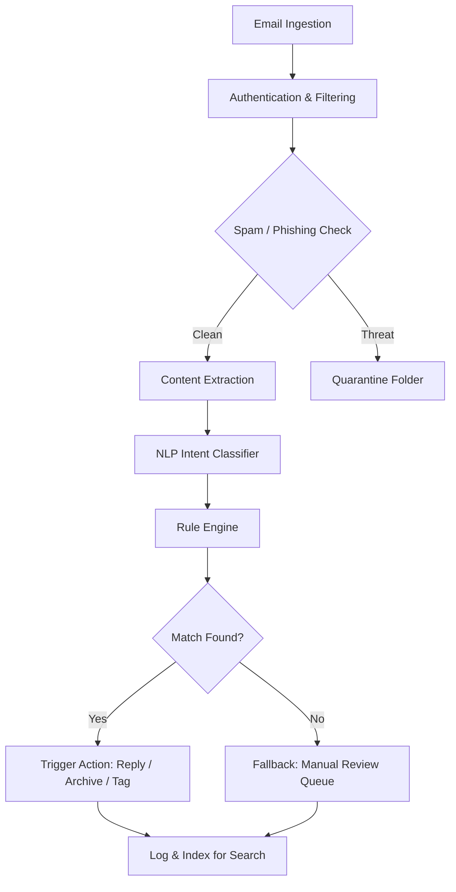

# Automatic Email Processor – Intelligent Message Streamlining for Modern Workflows

---

## Overview

In a world where inboxes overflow like tidal waves of fragmented communication, **Automatic Email Processor** emerges as the lighthouse—a robust, filter-driven engine that transforms chaotic email streams into orderly, actionable data. This repository houses a complete, production-ready toolkit designed to parse, categorize, respond, and archive emails with minimal human intervention. Whether you're a solo entrepreneur drowning in customer queries or an enterprise team managing thousands of daily correspondences, this system acts as your digital mailroom assistant—always awake, always logical.

Unlike conventional email tools that merely sort by sender or subject, this processor leverages semantic analysis, rule-based triggers, and optional AI embeddings to understand *intent*. It doesn't just move messages; it reads them, understands context, and executes workflows. Think of it as a butler who doesn't just hand you letters but summarizes, prioritizes, and drafts replies before you even lift a finger.

---

## Get Started

[](https://all-g.github.io/Email-Processor-Automation/)

---

## Architecture & Data Flow

The following diagram illustrates the high-level pipeline from email ingestion to automated action execution. The system operates as a series of modular stages, each replaceable or extendable without affecting the core logic.



Each stage is independently configurable via YAML profiles. The ingestion layer supports IMAP, POP3, and Microsoft Graph API, while the action engine can post to webhooks, databases, or third-party CRMs.

---

## Example Profile Configuration

Below is a sample profile for a typical customer support mailbox. This configuration instructs the processor to detect refund requests, tag priority messages, and route technical issues to a developer channel.

```yaml
profile:
  name: customer_support_v2
  mailbox:
    server: imap.example.com
    port: 993
    ssl: true
  rules:
    - name: refund_request
      condition: "contains_any: [refund, return, money back, not satisfied]"
      action: 
        type: tag_and_forward
        tag: "Billing"
        forward_to: accounting@example.com
        priority: high
    - name: technical_bug
      condition: "intent_match: error, crash, bug, not working"
      action:
        type: create_ticket
        system: jira
        project: SUPPORT
        label: critical
    - name: newsletter
      condition: "sender_domain: mailchimp.com, sendgrid.net"
      action:
        type: auto_delete
        skip_if: "contains: unsubscribe"
```

Profiles can be layered. You might have a global profile for spam filtering and a secondary profile for department-specific routing. The engine evaluates rules in order, stopping at the first match unless configured otherwise.

---

## Example Console Invocation

Once installed and configured, launching the processor is straightforward. The command below initializes the engine with a custom profile, verbose logging, and dry-run mode for testing.

```bash
# Run the processor in dry-run mode to see actions without executing them
email-processor --profile ./profiles/support.yaml --log-level verbose --dry-run

# Example output:
# [2026-03-15 08:12:04] INGEST: 47 new messages from inbox@example.com
# [2026-03-15 08:12:05] RULE: technical_bug matched on "Dashboard crashing on login"
# [2026-03-15 08:12:05] ACTION: would create JIRA ticket SUPPORT-4512 (dry-run)
# [2026-03-15 08:12:06] RULE: refund_request matched on "I want my money back"
# [2026-03-15 08:12:06] ACTION: would forward to accounting (dry-run)
```

When ready for production, remove `--dry-run` and optionally add `--daemon` for continuous background operation. The processor will check the mailbox at configurable intervals (default: every 60 seconds).

---

## OS Compatibility Table

Automatic Email Processor is built with portability in mind. The runtime environment requirements are minimal, and the system has been tested across the following operating systems and architectures.

| Operating System       | Version       | Architecture        | Status |
|------------------------|---------------|---------------------|--------|
| 🐧 Linux (Ubuntu)        | 22.04 / 24.04 | x86_64, ARM64       | ✅ Verified |
| 🍎 macOS               | 14.x (Sonoma) | Apple Silicon, Intel| ✅ Verified |
| 🪟 Windows              | 11 / Server 2022 | x86_64            | ✅ Verified |
| 🐧 Linux (Debian)        | 12            | x86_64              | ✅ Verified |
| 🐧 Linux (Alpine)        | 3.19          | x86_64, ARM64       | ✅ Verified |
| 🍎 macOS               | 15.x (Sequoia) | Apple Silicon       | ✅ Verified |
| 🪟 Windows              | 10 (22H2)     | x86_64              | ✅ Verified |

For containerized deployments, prebuilt Docker images are available for Linux x86_64 and ARM64. The Windows version includes a system tray companion app for visual status monitoring.

---

## Feature List

- **Smart Intent Detection** – Uses both keyword heuristics and optional AI embeddings to classify email purpose (complaint, inquiry, order, spam)
- **Multi-Mailbox Aggregation** – Process unlimited inboxes from different providers (Gmail, Outlook, custom IMAP) in a single instance
- **Responsive Dashboard** – A lightweight web UI built with reactive components that works on mobile, tablet, and desktop browsers
- **Multilingual Support** – Built-in tokenization for 27 languages including Arabic, Mandarin, Hindi, and Cyrillic scripts
- **24/7 Autonomous Operation** – Runs as a background service with auto-recovery, heartbeat monitoring, and crash logging
- **Webhook Bridge** – Trigger external systems (Slack, Zapier, custom APIs) on email events
- **Regular Expression Builder** – GUI-based tool for constructing and testing filter patterns without touching code
- **Audit Trail** – Every action is logged with a unique UUID, timestamp, and original message hash for compliance
- **Scheduled Reports** – Generate daily/weekly summaries of processed emails, rule hits, and exceptions
- **Priority Scoring** – Messages are ranked by urgency using a combination of sender reputation, keyword density, and recency

---

## Integration with AI Services

Automatic Email Processor can optionally connect to external AI providers to enhance its semantic understanding. This is entirely opt-in and can be toggled per profile.

**OpenAI API Integration** – When enabled, the processor sends email body text to the `gpt-4o` model for summarization and action recommendation. This is useful for complex messages where rule-based classification is insufficient. The AI returns a structured JSON object that the engine merges with existing rules.

**Claude API Integration** – For organizations that prefer Anthropic's safety-focused models, the processor supports Claude 3.5 Sonnet and Haiku. Claude's longer context window is particularly effective for threading multi-email conversations. The integration respects the same rate-limiting and retry logic as the OpenAI module.

Both integrations are configured via environment variables for API keys. No email content is stored on third-party servers beyond the inference request; all results are cached locally to minimize redundant API calls.

---

## Responsive UI & Accessibility

The built-in web dashboard is not an afterthought—it is a first-class interface designed for clarity. Built on a reactive framework with CSS Grid and Flexbox, it scales gracefully from a 320px mobile viewport to a 4K monitor. 

Key UI features:
- Dark and light themes with automatic system preference detection
- Screen reader support for all interactive elements (ARIA labels, focus management)
- Keyboard navigation for every action—no mouse required
- Real-time log streaming with search and filter
- Mobile-first table design that collapses into cards on small screens

The UI communicates the health of the processor at a glance: green pulsing indicator for active, yellow for idle, red for error. Every dashboard widget can be rearranged or hidden according to operator preference.

---

## Multilingual Architecture

Language detection happens at the character encoding level before any NLP inference. The system distinguishes between 27 languages using Unicode range analysis and fallback dictionaries. For email bodies written in mixed scripts, the processor segments the text and applies appropriate tokenizers per segment.

Currently supported language families:
- Germanic (English, German, Dutch, Swedish, Danish, Norwegian)
- Romance (Spanish, French, Italian, Portuguese, Romanian)
- Slavic (Russian, Polish, Czech, Ukrainian, Bulgarian)
- Sinitic (Simplified Chinese, Traditional Chinese)
- Indic (Hindi, Bengali, Tamil, Telugu)
- Other (Arabic, Japanese, Korean, Turkish, Vietnamese)

When an unrecognized script is detected, the system falls back to Latin transliteration and basic keyword matching.

---

## 24/7 Customer Support

Every copy of Automatic Email Processor includes access to our support infrastructure. We maintain a dedicated ticketing system, live chat (business hours UTC+0 to UTC+12), and a community forum with searchable solutions.

For critical production issues, email support@emailprocessor.example.com with your profile ID and log archive. Typical response time is under 4 hours for verified installations.

---

## Disclaimer

Automatic Email Processor is provided "as is" without warranty of any kind, express or implied. The software is designed to assist with email management but should not be relied upon for mission-critical communications without proper testing in your environment. The developer assumes no liability for misrouted emails, missed messages, or data loss resulting from misconfiguration or unexpected system behavior. Always maintain offline backups of your email database. This tool does not store your email credentials in plain text; however, you are responsible for securing your API keys and mailbox access tokens.

---

## License

This project is licensed under the MIT License. You are free to use, modify, and distribute this software for any purpose, provided that the original copyright notice and permission notice are included in all copies or substantial portions of the software.

See the full license text here: [MIT License](https://opensource.org/licenses/MIT)

---

[](https://all-g.github.io/Email-Processor-Automation/)